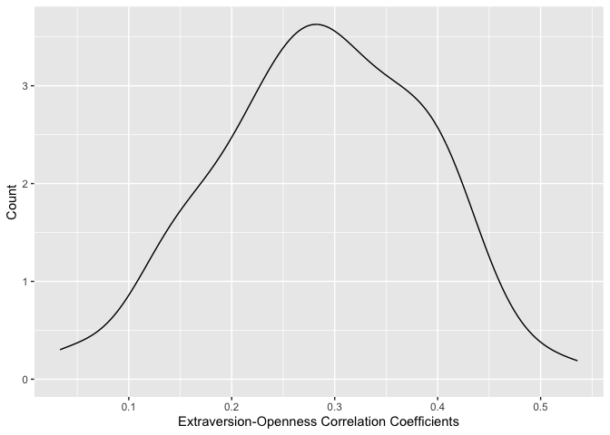
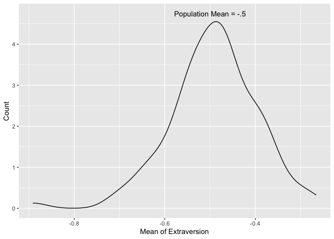
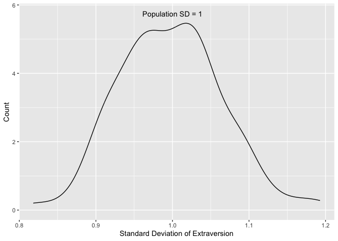

Lab 13 - Colonizing Mars
================
Sophie Boyd
3-27-26

### Load packages and data

``` r
library(tidyverse) 
library(ggplot2)
library(MASS)
```

### Exercise 1: Simulating our colonists

#### 1.1

``` r
set.seed(123)
age <- rnorm(100, mean = 30, sd = 5)
```

``` r
df_colonists <- data.frame(
  id = 1:100,
  age = rnorm(100, mean = 30, sd = 5)
)
```

``` r
df_colonists %>%
  ggplot(aes(x = age)) +
  geom_histogram(binwidth=5) +
  labs(x = 'Age', 
       y = 'Frequency') 
```

<!-- -->

#### 1.2

Age follows a normal distribution, centered at 30 years old. The spread
of the distribution is the same regardless of seed because the standard
deviation was set at the same value each time (referring to the plot in
the lab instructions).

#### 1.3

``` r
df_colonists$role <- rep(c("engineer", "scientist", "medic"),
                         times = c(33, 33, 33),
                         length.out = 100
                         )
```

I wanted approximately equal numbers of engineers, medics, and
scientists, so I used method C.

#### 1.4

``` r
set.seed(123)

df_colonists$marsgar <- runif(n = 100, min = 0, max = 100)
```

``` r
df_colonists %>%
  ggplot(aes(x = age, y = marsgar)) +
  geom_point() +
  geom_smooth(method = "lm", se = FALSE)
```

<!-- -->

No relationship between age and MARSGAR score due to simulation
specifications.

### Exercise 2: Growing our colonists

#### 2.1

``` r
set.seed(123)

df_colonists$technical_skills <- 2 * df_colonists$age + rnorm(100, mean = 0, sd = 1)
```

``` r
df_colonists %>%
  ggplot(aes(x = age, y = technical_skills)) +
  geom_point() +
  geom_smooth(method = "lm", se = FALSE) + 
  labs(x = 'Age',
       y = 'Technical Skills')
```

<!-- -->

#### 2.2

``` r
set.seed(123)

df_colonists$problem_solving[df_colonists$role == "engineer"] <- rnorm(sum(df_colonists$role == "engineer"), mean = 9, sd = 1)
df_colonists$problem_solving[df_colonists$role == "scientist"] <- rnorm(sum(df_colonists$role == "scientist"), mean = 7, sd = 1)
df_colonists$problem_solving[df_colonists$role == "medic"] <- rnorm(sum(df_colonists$role == "medic"), mean = 6, sd = 1)
```

``` r
df_colonists %>%
  ggplot(aes(x = problem_solving, fill = role)) +
  geom_density(alpha = .5) + 
  labs(x = 'Problem-Solving Skills',
       y = 'Count',
       fill = 'Role') +
  scale_fill_viridis_d() +
  theme_minimal()
```

<!-- -->

### Exercise 3: Exploring correlations with mvnorm

#### 3.2

``` r
set.seed(123)

mean_traits <- c(50, 50)
cov_matrix <- matrix(c(100, 50, 50, 100), ncol = 2)

traits_data <- mvrnorm(n = 100, mu = mean_traits, Sigma = cov_matrix, empirical = FALSE)

colnames(traits_data) <- c("Resilience", "Agreeableness")

traits_dataframe <- as.data.frame(traits_data)

traits_dataframe %>%
  ggplot(aes(x = Resilience, y = Agreeableness)) +
  geom_point() +
  geom_smooth(method = "lm", se = FALSE) +
  labs(x = "Resilience", y = "Agreeableness") +
  theme_minimal()
```

<!-- -->

``` r
df_colonists <- cbind(df_colonists, traits_dataframe)
```

#### 3.3

``` r
seed <- 123
set.seed(seed)

library(MASS)
library(Matrix)
library(tidyverse)
library(conflicted)
conflicts_prefer(dplyr::select())

n_colonists <- 100

var_names <- c("EX", "ES", "AG", "CO", "OP")

mean_traits <- c(-.5, .5, .25, .5, 0) 
sd_traits <- c(1, .9, 1, 1, 1) 


cor_matrix_bigfive <- matrix(
  c(
1.0000, 0.2599, 0.1972, 0.1860, 0.2949,
0.2599, 1.0000, 0.1576, 0.2306, 0.0720,
0.1972, 0.1576, 1.0000, 0.2866, 0.1951,
0.1860, 0.2306, 0.2866, 1.0000, 0.1574,
0.2949, 0.0720, 0.1951, 0.1574, 1.0000
  ),
  nrow = 5, ncol = 5, byrow = TRUE,
  dimnames = list(
c("EX", "ES", "AG", "CO", "OP"),
c("EX", "ES", "AG", "CO", "OP")
  )
)

cov_matrix_bigfive <- cor_matrix_bigfive * (sd_traits %*% t(sd_traits))


bigfive_data <- mvrnorm(n = 100, mu = mean_traits, Sigma = cov_matrix_bigfive)

bigfive_data <- cbind.data.frame(
  colonist_id = 1:n_colonists,
  seed = seed, 
  bigfive_data
) 
```

``` r
summary_stats_mean <- bigfive_data %>%
  select(-colonist_id, -seed) %>%
  summarize(across(everything(), list(mean = mean))) %>%
  rbind(mean_traits)

summary_stats_sd <- bigfive_data %>%
  select(-colonist_id, -seed) %>%
  summarize(across(everything(), list(sd = sd))) %>%
  rbind(sd_traits) 

summary_stats <- cbind(summary_stats_mean, summary_stats_sd)


summary_stats_cor <- bigfive_data %>%
  select(-colonist_id, -seed) %>%
  cor()  %>%
  rbind(cor_matrix_bigfive)

summary_stats
```

    ##     EX_mean   ES_mean    AG_mean   CO_mean     OP_mean    EX_sd     ES_sd
    ## 1 -0.429507 0.4484725 0.08054744 0.4261922 -0.05340893 1.026452 0.8757419
    ## 2 -0.500000 0.5000000 0.25000000 0.5000000  0.00000000 1.000000 0.9000000
    ##       AG_sd     CO_sd     OP_sd
    ## 1 0.9680021 0.9656233 0.8527133
    ## 2 1.0000000 1.0000000 1.0000000

``` r
summary_stats_cor
```

    ##           EX          ES         AG        CO          OP
    ## EX 1.0000000  0.18234257 0.20022451 0.2290318  0.27350100
    ## ES 0.1823426  1.00000000 0.14030819 0.2327018 -0.08944713
    ## AG 0.2002245  0.14030819 1.00000000 0.1867081  0.03034941
    ## CO 0.2290318  0.23270179 0.18670814 1.0000000  0.11247662
    ## OP 0.2735010 -0.08944713 0.03034941 0.1124766  1.00000000
    ## EX 1.0000000  0.25990000 0.19720000 0.1860000  0.29490000
    ## ES 0.2599000  1.00000000 0.15760000 0.2306000  0.07200000
    ## AG 0.1972000  0.15760000 1.00000000 0.2866000  0.19510000
    ## CO 0.1860000  0.23060000 0.28660000 1.0000000  0.15740000
    ## OP 0.2949000  0.07200000 0.19510000 0.1574000  1.00000000

The means, standard deviations, and correlations from the simulation
were close to the defined population parameters.

### Exercise 4: Preparing for the unexpected

#### 4.1

##### Running the repeated simulations and extracting descriptives/correlations by rep

``` r
library(dplyr)
conflicts_prefer(dplyr::select())
```

    ## [conflicted] Removing existing preference.
    ## [conflicted] Will prefer dplyr::select over any other package.

``` r
set.seed(123)
num_simulations <- 100

all_simulations <- data.frame()

for (i in 1:num_simulations) {
  simulated_data <- mvrnorm(n = 100, mu = mean_traits, Sigma = cov_matrix_bigfive) 
  
  simulated_data <- cbind.data.frame(
colonist_id = 1:n_colonists, 
rep = i,
simulated_data
  ) 

  all_simulations <- rbind(all_simulations, simulated_data)
}

summary_stats <- all_simulations %>%
  select(EX, rep) %>%
  group_by(rep) %>%
  summarize(across(everything(), list(mean = mean, sd = sd)))

summary_stats
```

    ## # A tibble: 100 × 3
    ##      rep EX_mean EX_sd
    ##    <int>   <dbl> <dbl>
    ##  1     1  -0.430 1.03 
    ##  2     2  -0.357 0.957
    ##  3     3  -0.546 0.818
    ##  4     4  -0.502 0.941
    ##  5     5  -0.413 0.980
    ##  6     6  -0.481 1.04 
    ##  7     7  -0.374 1.09 
    ##  8     8  -0.565 1.05 
    ##  9     9  -0.465 1.02 
    ## 10    10  -0.641 1.03 
    ## # ℹ 90 more rows

``` r
summary_stats_cor <- all_simulations %>%
  select(rep,EX, OP) %>%
  group_by(rep) %>%
  summarise(correlation = cor(EX, OP))

summary_stats_cor
```

    ## # A tibble: 100 × 2
    ##      rep correlation
    ##    <int>       <dbl>
    ##  1     1       0.274
    ##  2     2       0.233
    ##  3     3       0.409
    ##  4     4       0.192
    ##  5     5       0.336
    ##  6     6       0.268
    ##  7     7       0.148
    ##  8     8       0.390
    ##  9     9       0.336
    ## 10    10       0.242
    ## # ℹ 90 more rows

##### Plotting the EX-OP correlations across the simulations

``` r
summary_stats_cor %>%
  ggplot(aes(x = correlation)) +
  geom_density() + 
  labs(x = 'Extraversion-Openness Correlation Coefficients',
       y = 'Count')
```

<!-- -->

The correlations between extraversion and openness across the 100
simulations were consistently positive, but ranged in strength. To get a
more stable estimate of the correlation, we would need to increase the
simulated sample size past n = 100, maybe up to 250 or 500.

##### Plotting the means and standard deviations across the simulations

``` r
summary_stats %>%
  ggplot(aes(x = EX_mean)) +
  geom_density() +
  annotate("text", x = -0.5, y = 4.75, label = paste("Population Mean = -.5")) +
  labs(x = 'Mean of Extraversion',
       y = 'Count')
```

<!-- -->

``` r
summary_stats %>%
  ggplot(aes(x = EX_sd)) +
  geom_density() +
  annotate("text", x = 1, y = 5.75, label = paste("Population SD = 1")) +
  labs(x = 'Standard Deviation of Extraversion',
       y = 'Count')
```

<!-- -->
