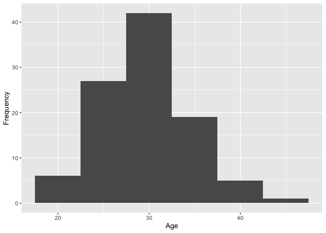
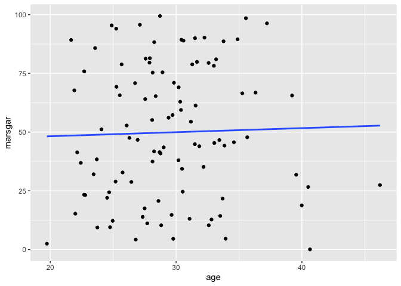
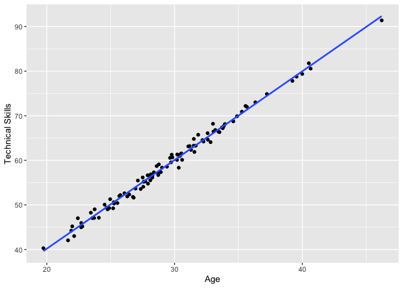
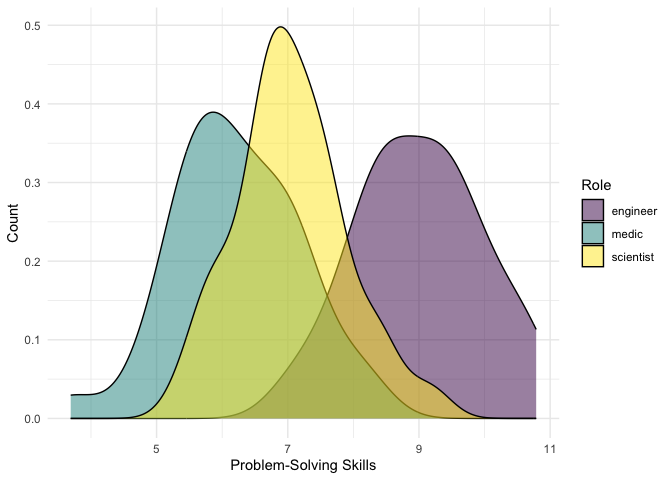
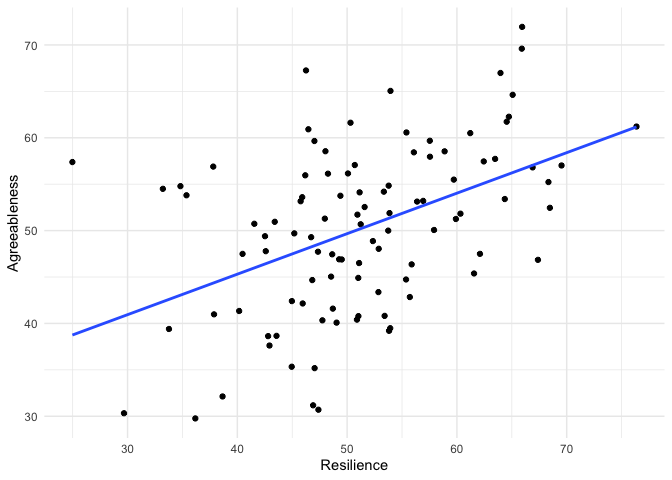

Lab 13 - Colonizing Mars
================
Sophie Boyd
3-27-26

### Load packages and data

``` r
library(tidyverse) 
library(ggplot2)
library(MASS)
```

### Exercise 1: Simulating our colonists

#### 1.1

``` r
set.seed(123)
age <- rnorm(100, mean = 30, sd = 5)
```

``` r
df_colonists <- data.frame(
  id = 1:100,
  age = rnorm(100, mean = 30, sd = 5)
)
```

``` r
df_colonists %>%
  ggplot(aes(x = age)) +
  geom_histogram(binwidth=5) +
  labs(x = 'Age', 
       y = 'Frequency') 
```

<!-- -->

Age follows a normal distribution, centered at around 30 years old. The
spread of the distribution is the same regardless of seed because the
standard deviation was set at the same value each time (referring to the
plot in the lab instructions).

#### 1.2

``` r
df_colonists$role <- rep(c("engineer", "scientist", "medic"),
                         times = c(33, 33, 33),
                         length.out = 100
                         )
```

#### 1.3

I wanted approximately equal numbers of engineers, medics, and
scientists, so I used method C.

#### 1.4

``` r
set.seed(123)

df_colonists$marsgar <- runif(n = 100, min = 0, max = 100)
```

``` r
df_colonists %>%
  ggplot(aes(x = age, y = marsgar)) +
  geom_point() +
  geom_smooth(method = "lm", se = FALSE)
```

<!-- -->

No relationship between age and MARSGAR score due to simulation
specifications.

### Exercise 2: Growing our colonists

#### 2.1

``` r
set.seed(123)

df_colonists$technical_skills <- 2 * df_colonists$age + rnorm(100, mean = 0, sd = 1)
```

``` r
df_colonists %>%
  ggplot(aes(x = age, y = technical_skills)) +
  geom_point() +
  geom_smooth(method = "lm", se = FALSE) + 
  labs(x = 'Age',
       y = 'Technical Skills')
```

<!-- -->

#### 2.2

``` r
set.seed(123)

df_colonists$problem_solving[df_colonists$role == "engineer"] <- rnorm(sum(df_colonists$role == "engineer"), mean = 9, sd = 1)
df_colonists$problem_solving[df_colonists$role == "scientist"] <- rnorm(sum(df_colonists$role == "scientist"), mean = 7, sd = 1)
df_colonists$problem_solving[df_colonists$role == "medic"] <- rnorm(sum(df_colonists$role == "medic"), mean = 6, sd = 1)
```

``` r
df_colonists %>%
  ggplot(aes(x = problem_solving, fill = role)) +
  geom_density(alpha = .5) + 
  labs(x = 'Problem-Solving Skills',
       y = 'Count',
       fill = 'Role') +
  scale_fill_viridis_d() +
  theme_minimal()
```

<!-- -->

### Exercise 3: Exploring correlations with mvnorm

#### 3.1

``` r
set.seed(123)

mean_traits <- c(50, 50)
cov_matrix <- matrix(c(100, 50, 50, 100), ncol = 2)

traits_data <- mvrnorm(n = 100, mu = mean_traits, Sigma = cov_matrix, empirical = FALSE)

colnames(traits_data) <- c("Resilience", "Agreeableness")

traits_dataframe <- as.data.frame(traits_data)

traits_dataframe %>%
  ggplot(aes(x = Resilience, y = Agreeableness)) +
  geom_point() +
  geom_smooth(method = "lm", se = FALSE) +
  labs(x = "Resilience", y = "Agreeableness") +
  theme_minimal()
```

<!-- -->

``` r
df_colonists <- cbind(df_colonists, traits_dataframe)
```

#### 3.2

``` r
seed <- 123
set.seed(seed)

library(MASS)
library(Matrix)
```

    ## 
    ## Attaching package: 'Matrix'

    ## The following objects are masked from 'package:tidyr':
    ## 
    ##     expand, pack, unpack

``` r
library(tidyverse)
library(conflicted)
conflicts_prefer(dplyr::select())
```

    ## [conflicted] Will prefer dplyr::select over any other package.

``` r
n_colonists <- 100

var_names <- c("EX", "ES", "AG", "CO", "OP")

mean_traits <- c(-.5, .5, .25, .5, 0) 
sd_traits <- c(1, .9, 1, 1, 1) 


cor_matrix_bigfive <- matrix(
  c(
1.0000, 0.2599, 0.1972, 0.1860, 0.2949,
0.2599, 1.0000, 0.1576, 0.2306, 0.0720,
0.1972, 0.1576, 1.0000, 0.2866, 0.1951,
0.1860, 0.2306, 0.2866, 1.0000, 0.1574,
0.2949, 0.0720, 0.1951, 0.1574, 1.0000
  ),
  nrow = 5, ncol = 5, byrow = TRUE,
  dimnames = list(
c("EX", "ES", "AG", "CO", "OP"),
c("EX", "ES", "AG", "CO", "OP")
  )
)

cov_matrix_bigfive <- cor_matrix_bigfive * (sd_traits %*% t(sd_traits))


bigfive_data <- mvrnorm(n = 100, mu = mean_traits, Sigma = cov_matrix_bigfive)

bigfive_data <- cbind.data.frame(
  colonist_id = 1:n_colonists,
  seed = seed, 
  bigfive_data
) 
```

``` r
mean(bigfive_data$EX)
```

    ## [1] -0.429507

``` r
sd(bigfive_data$EX)
```

    ## [1] 1.026452

``` r
mean(bigfive_data$ES)
```

    ## [1] 0.4484725

``` r
sd(bigfive_data$ES)
```

    ## [1] 0.8757419

``` r
mean(bigfive_data$AG)
```

    ## [1] 0.08054744

``` r
sd(bigfive_data$AG)
```

    ## [1] 0.9680021

``` r
mean(bigfive_data$CO)
```

    ## [1] 0.4261922

``` r
sd(bigfive_data$CO)
```

    ## [1] 0.9656233

``` r
mean(bigfive_data$OP)
```

    ## [1] -0.05340893

``` r
sd(bigfive_data$OP)
```

    ## [1] 0.8527133

### Exercise 4: Preparing for the unexpected

#### 4.1

``` r
library(dplyr)
conflicts_prefer(dplyr::select())
```

    ## [conflicted] Removing existing preference.
    ## [conflicted] Will prefer dplyr::select over any other package.

``` r
set.seed(123)
num_simulations <- 100

all_simulations <- data.frame()

for (i in 1:num_simulations) {
  simulated_data <- mvrnorm(n = 100, mu = mean_traits, Sigma = cov_matrix_bigfive) 
  
  simulated_data <- cbind.data.frame(
colonist_id = 1:n_colonists, 
rep = i,
simulated_data
  ) 

  all_simulations <- rbind(all_simulations, simulated_data)
}

summary_stats <- all_simulations %>%
  group_by(rep) %>%
  select(EX, rep) %>%
  summarize(across(everything(), list(mean = mean, sd = sd)))

summary_stats
```

    ## # A tibble: 100 × 3
    ##      rep EX_mean EX_sd
    ##    <int>   <dbl> <dbl>
    ##  1     1  -0.430 1.03 
    ##  2     2  -0.357 0.957
    ##  3     3  -0.546 0.818
    ##  4     4  -0.502 0.941
    ##  5     5  -0.413 0.980
    ##  6     6  -0.481 1.04 
    ##  7     7  -0.374 1.09 
    ##  8     8  -0.565 1.05 
    ##  9     9  -0.465 1.02 
    ## 10    10  -0.641 1.03 
    ## # ℹ 90 more rows

``` r
summary_stats_cor <- simulated_data %>%
  group_by(rep) %>%
  select(rep, EX, OP) %>%
  cor() 
```

    ## Warning in cor(.): the standard deviation is zero

``` r
summary_stats_cor
```

    ##     rep        EX        OP
    ## rep   1        NA        NA
    ## EX   NA 1.0000000 0.3120541
    ## OP   NA 0.3120541 1.0000000
